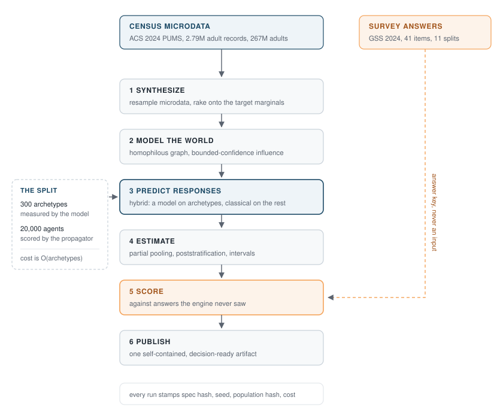

# quorum

[](https://github.com/maisymylod/quorum/actions/workflows/ci.yml)
[](LICENSE)

A **population simulation engine**. Synthesize a representative population from real
census marginals, simulate how it answers a question, and score the answer against a
published survey result the simulation never sees.

The claim the repository has to earn is narrow and checkable: *given a question,
predict the population's aggregate answer distribution, and be measurably right.*
Every design decision below serves that claim being verifiable rather than asserted.

```bash
make install
make demo     # synthesize, ask, estimate, publish, from a clean clone
make eval     # rerun the ablation grid and regenerate EVAL.md
make test     # tests plus the quality gates
```

`make demo` runs the welfare wording experiment described below and writes
`artifacts/welfare/report.html`.

## Ground truth

Two independent public sources, which is the only reason an accuracy number here means
anything.

| | Source | Scale | Role |
|---|---|---|---|
| Population | American Community Survey 2024 1-Year PUMS | 2,790,132 adult records, 267.2M adults | what a synthesized population is raked to |
| Answers | General Social Survey 2024 | 3,309 respondents, 41 scored items | what a prediction is scored against |

The population is built from census data; the answers it is scored against come from a
survey the synthesis never sees. They meet only at a shared attribute taxonomy. Details
and caveats: [`data/vendor/PROVENANCE.md`](data/vendor/PROVENANCE.md).

### The hard part of the test

Eleven of those items are **randomized wording experiments**: the same spending
question asked two ways, each way to a random half of respondents. Because the halves
are assigned at random they describe the same population, so any difference between
them is caused by the wording alone. That is an answer key an ordinary topline cannot
be.

The best known of them is welfare. In 2024, **33.4%** said we spend too little on
*"welfare"*; **70.5%** said we spend too little on *"assistance to the poor"*. Same
population, same survey, same year, thirty-seven points apart.

A simulator that predicts both arms identically scores respectably on average error and
has not read the question at all. So the harness scores the gaps separately, on sign
and on magnitude, and CI gates on both.

## The loop

<p align="center">
  
</p>

Each stage is a Protocol in [`core/contracts.py`](src/quorum/core/contracts.py), so any
implementation satisfying the shape drops in. That is what makes the ablation grid a
matter of configuration rather than code, and it is why the grid exists at all: the
architectural claims below are entries in it, not sentences here.

## Five decisions worth calling out

**Populations are columnar, not `list[Agent]`.** The obvious modelling does not survive
scale: at 100k agents every marginal, stratification and reweight becomes a Python
loop. `Population` wraps one dataframe with an explicit weight column so those
operations are vectorized, and materializing an `Agent` is an explicit, rare act.

**Agents return distributions, not choices.** A respondent that reports only its modal
answer throws away the information that makes an aggregate topline calibrated. A
population of confident agents produces a confident population, which is not what a
real one looks like.

**The model is called once per archetype, not once per agent.** Asking about every
agent makes a simulation cost O(population), so population size becomes a budget
decision rather than a modelling one. The hybrid spends the model budget on a
stratified sample covering every cell, fits a propagator to those answers, and scores
the rest classically. Three other cost levers are structural: the shared half of the
prompt goes first so it is a cacheable prefix, the answer format is schema-constrained
so a malformed response is a provider error rather than a parsing problem, and answers
are content-addressed and cached to disk.

**Uncertainty comes from the sample, not the population.** A synthetic population can be
made as large as anyone likes, so the spread of a topline over 100,000 agents measures
a choice the author made. The spread across the archetypes a model was actually asked
about measures the thing in doubt. Two routes to it ship, one parametric and one by
resampling, and `interval_agreement` reports how far apart they land, because when a
parametric interval is wrong it is usually wrong quietly.

**Reproducibility comes from the cache, not from a seed.** Current models reject
sampling parameters, so a run cannot be pinned by temperature. It is pinned by
remembering what the model said. Everything else, synthesis through posterior draws, is
seeded and deterministic, and a test asserts that the same spec and seed give the same
population fingerprint and the same answer.

## Accuracy is a gate

[`eval/gates.py`](src/quorum/eval/gates.py) holds the thresholds a run has to clear;
`quorum eval --check` and CI enforce them. A metric that is reported but not enforced
drifts, and a change that quietly makes the engine worse should fail a build rather
than appear as a slightly different number in a table nobody diffed.

Gates about plumbing hold for every run: the population must match its targets to
within 1e-6, every question must be scored, and the baselines must order themselves the
way arithmetic says they must. Gates about prediction (skill against the baseline,
calibration, interval coverage, wording-gap sign and magnitude) are enforced only when
a real model produced the answers.

## What's real vs simulated

**Real.** The census marginals and the microdata the population is drawn from. The
survey toplines, their sampling errors, and the randomized assignment that makes the
wording experiments interpretable. The question wording, read verbatim out of the
published codebook rather than transcribed.

**Simulated.** The agents. Their latent traits. The social graph and any peer influence
over it. And, right now, the answers.

**The answers are the honest gap.** `quorum` ships with an offline stub provider that
hashes a prompt into a distribution, so the whole pipeline runs anywhere with no key
and no network. The stub knows nothing about the world and cannot predict anything, and
**no accuracy claim in this repository rests on it**: `EVAL.md` leads with a warning,
every published artifact carries a callout above the first number, every run record
carries a note, and the prediction gates report as skipped. Running

```bash
make eval EVAL_ARGS="--provider anthropic --model claude-opus-5 --check"
```

activates them. Nothing about the engine, the harness or the gates changes when it does.

See [`MODEL_CARD.md`](MODEL_CARD.md) for the assumptions that are known to be shaky and
what this should not be used for, and [`EVAL.md`](EVAL.md) for the current numbers.

## Capabilities demonstrated

Synthetic population generation and iterative proportional fitting; agent-based
simulation at scale; hybrid architectures combining a language model with classical
statistical methods; multilevel partial pooling, poststratification and Bayesian
interval estimation; Monte Carlo and bootstrap uncertainty propagation; evaluation,
calibration and accuracy infrastructure measured against real ground truth; cost and
latency engineering for large model workloads; reproducible, seed-deterministic
pipelines with enforced quality gates.

## Layout

```
src/quorum/
  core/        contracts, the agent and population objects, the spec, the run record
  data/        the shared taxonomy, source harmonization, typed ground-truth loaders
  synthesis/   raking, microdata resampling, marginal fidelity
  world/       the scenario, the social graph, peer influence
  predict/     providers, the response cache, propagators, the hybrid, baselines
  infer/       partial pooling, poststratification, bootstrap intervals
  eval/        metrics, the backtest, the ablation grid, the gates, the report
  exec/        assembling a spec into a run, cost accounting, the budget
  publish/     contrasts, inline SVG charts, the decision-ready artifact
```

## License

MIT.
